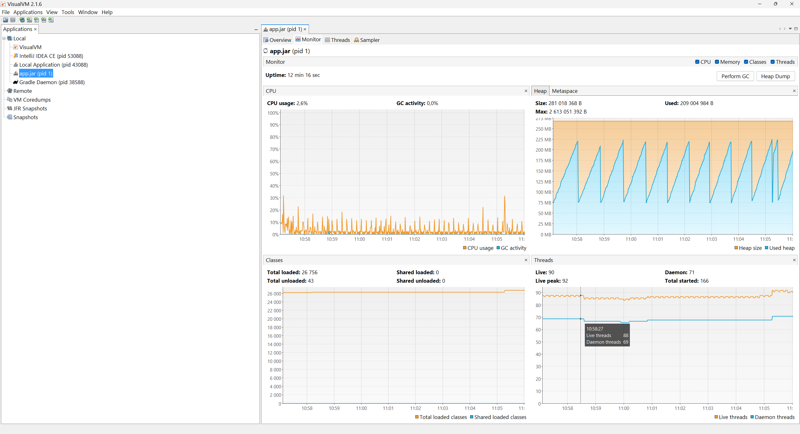

# Mail Service

[](https://sonarcloud.io/summary/new_code?id=AlexOmarov_mail-service)
[](https://sonarcloud.io/summary/new_code?id=AlexOmarov_mail-service)

Web-сервис с простым сценарием и примерами использования инструментов, подходов к проектированию.

Основная функция сервиса - принимать из различных источников обьект с полями email/text,
заполнять по нему письмо и по планировщику отправлять на smtp сервер.
Сервис имеет 2 клиентские операции - создание и получение письма.
Отправка письма на smtp сервер проходит асинхронно, по планировщику.

Импорт проекта в IntellijIDEA не требует настроек локальной среды,
проект может быть импортирован в IDE с помощью меню `File->New->Project from existing sources->Gradle`.

## Содержание
- [Используемые инструменты](#Используемые-инструменты)
- [Техническое наполнение](#Техническое-наполнение)
- [Развертка](#Развертка)
- [Использование ](#Использование-code-quality-инструментов)
- [Использование развёрнутой системы](#Использование-развёрнутой-системы)
- [Публикация](#Публикация)

### Используемые инструменты
Сервис построен на фреймворках, поддерживающих [Reactive Streams](https://www.reactive-streams.org/) спецификацию:
- [WebFlux](https://docs.spring.io/spring-framework/reference/web/webflux.html)
- [Kotlin coroutines](https://kotlinlang.org/docs/coroutines-overview.html)
- [Reactor Kafka](https://github.com/reactor/reactor-kafka)
- [Reactive Redis](https://developer.redis.com/develop/java/spring/rate-limiting/fixed-window/reactive/)
- [Reactive Postgres](https://github.com/pgjdbc/r2dbc-postgresql)

Для отправки email-сообщений используется фреймворк [Spring Mail](https://docs.spring.io/spring-framework/reference/integration/email.html).
Для работы с ним в неблокирующей среде используется пул Dispatchers.IO. 
В перспективе этот пул можно будет заменить на виртуальные потоки из [Project Loom](https://wiki.openjdk.org/display/loom/Main).

Полный список используемых библиотек можно найти в файле [libs.versions.toml](gradle/libs.versions.toml)

### Техническое наполнение
Сервис имеет следующие технические возможности:
1. API представлен в двух типах: rsocket и http.
2. Создание письма через Kafka и отправка сообщений при изменении статуса.
3. Basic авторизация для rsocket/http с использованием Spring Security.
4. Используется бинарный формат данных [Hessian](http://hessian.caucho.com/) для RSocket, с возможностью замены на [CBOR](https://cbor.io/). 
5. Настроен мониторинг: метрики, логи, трейсы; метрики доступны по http.
6. Настроено jmx-подключение внутри docker-контейнера.
7. Работа с Postgres и миграции с помощью Flyway.
8. Использование Redis для хранения сообщений.
9. Распределенный планировщик с горизонтальным масштабированием с помощью [ShedLock](https://github.com/lukas-krecan/ShedLock)
10. Планировщик [LoadScheduler](mail-service-app/src/main/kotlin/ru/somarov/mail/application/scheduler/LoadScheduler.kt) для имитации работы с сервисом.
11. Описание http-спецификаций с помощью openapi.

12. При наличии гейтвея и достаточного количества партиций в kafka-очередях сервис поддерживает 
горизонтальное масштабирование и может использоваться в рамках kubernetes-кластера.

Кроме того, есть несколько особенностей github-репозитория:
1. Автоматическое обновление версии сервиса в gradle.properties при релизе.
2. Автоматические проверки качества: синтаксический анализ, тесты, статический анализ с Sonar.
3. Настроена автоматическая сборка и выкладка docker-образа по созданию нового релиза в github.
Результаты тестов и анализа кода доступны в [Sonarcloud](https://sonarcloud.io/project/overview?id=AlexOmarov_mail-service), docker-образ доступен в [Docker registry](https://hub.docker.com/repository/docker/decentboat/mail-service/general)

### Развертка
Наиболее удобно развернуть сервис и все стоонние системы используя Docker.
```bash
docker-compose up -d
```

Compose файл включает в себя следующие инструменты (с открытыми портами):
1. Postgres - 7000
2. PGAdmin - 4002
3. Zookeeper - 2181
4. Kafka - 29092
5. [Kafka-UI](https://github.com/provectus/kafka-ui) - 9001
6. Schema Registry (будет использоваться в будущем)  - 6005
7. OtelCollector - 4317/4318/4319
8. DataPrepper
9. Opensearch
10. Opensearch dashboards - 5601
11. Clickhouse - 8123/9000
12. DataLens - 8855
13. KeyDB - 6379
14. Prometheus - 9090 (пока opensearch не может принимать метрики в otlp формате)
15. [MailSlurper](https://www.mailslurper.com/) - 2500/8085/8083
16. Mock server - 5001
17. Сервис - localhost:8080, localhost:9091, localhost:7001, localhost:9010

**Важно!** Запуск потребует скачивания недостающих образов для запуска всех контейнеров 
и около 8 ГБ оперативной памяти в процессе работы развёртки.

#### Локальная развертка
Сервис может разворачиваться и локально, с использованием собранного исходного кода вместо docker-образа.
Для этого необходимо изначально провести развертку с использованием Docker compose файла, 
после этого удалить контейнер с сервисом (service), собрать проект и запустить его либо через IDE, 
либо внеся изменения в docker compose файл - раскомментировать строки build/context контейнера service 
и убрать настройку image (предварительно собрать проект, получить jar). 
Для запуска через IDE (например для проведения debug-а) необходимо прописать 
системную переменную `contour.database.port=7000`

### Использование развёрнутой системы
Доступные инструменты окружения:
1. [Kafka UI](http://localhost:9001/ui/clusters/local/all-topics) - позволяет также отправить ручные сообщения в очереди
   
2. [Openapi UI с описанием http-API сервиса](http://localhost:8080/webjars/swagger-ui/index.html#/) - авторизация user/password
   
3. [PGAdmin](http://localhost:4002/browser/) - мастер-пароль 123, пароль для подключения к базе test
   
   
4. [Redis](https://github.com/qishibo/AnotherRedisDesktopManager/releases) - Используется программа AnotherRedisDesktopManager. Подключение localhost:6379, пароль 123
   
5. [Smtp сервер](http://localhost:8083/)
   
6. [Actuator API сервиса](http://localhost:8080/actuator)
   
7. [JMX подключение](https://visualvm.github.io/) - Используется VisualVM. Локальное jmx соединение, адрес localhost:9010
   
8. [Opensearch logs](http://localhost:5601)
   
9. [Opensearch metrics](http://localhost:5601) - необходимо добавить prometheus, в dev tools выполнить следующий запрос
   ```
   POST _plugins/_query/_datasources 
   {
       "name" : "monitoring-prometheus",
       "connector": "prometheus",
       "properties" : {
           "prometheus.uri" : "http://monitoring-prometheus.monitoring:9090"
       }
   }
   ```
   
10. [Opensearch traces](http://localhost:5601)  - необходимо создать index pattern traces-*
    
11. [DataLens](http://localhost:8855/collections) - необходимо настроить подключение и создать дашборд по таблице queue.
    

`Liveness` и `readiness` API доступны по `actuator/health/liveness` и `actuator/health/readiness` путям.
Также для ручного вызова доступны API сервиса по адресам `localhost:7001` (rsocket, websocket соединение), `localhost:8080` (http).  
Для работы с rsocket рекомендуется использовать Postman, для работы с http - Opanapi ui.  
**Важно!** - rsocket API использует формат данных Hessian, поэтому постман в ответе на websocket-сообщение отобразит 
только сырые байты

### Использование code-quality инструментов
Когда проект собирается с использованием `build` задачи gradle detekt и ktlint проверки проходят автоматически. 
Detekt xml отчет формируется по путям `./build/app/reports/detekt`, `./build/api/reports/detekt`.  
Также есть возможность запускать проверки вручную командой
```bash  
.\gradlew detekt
```

Тестирование и измерение покрытия также проходят автоматически при вызове команды `build`. 
Покрытие измеряется инструментом kover, который в свою очередь использует движок JaCoCo.  
Отчеты по покрытию (xml для sonar-инструментов и html для локальной разработки)  
формируются по путям `./build/app/reports/kover/report.xml`, `./build/app/reports/kover/html/index.html`.  
Также есть возможность вызвать тестирование и измерение покрытия вручную, вызвав команду
```bash  
.\gradlew test koverPrintCoverage
```  
Процент покрытия также можно смотреть и в самой IDE.  
Для этого достаточно правой кнопкой мыши кликнуть на папку test и запустить задачу Run with Coverage.  
**Важно!** Тесты не пройдут, если одновременно в докере развернут compose!  

Прохождение Quality Gate реализовано с использованием gradle плагина sonarqube. Вызвать прохождение можно командами:
```bash  
.\gradlew build
.\gradlew sonar -D"sonar.host.url"="<SONAR_HOST>" -D"sonar.token"="YOUR_TOKEN" -D"sonar.projectKey"="KEY" -D"sonar.organization"="ORG"
```  

При вызове sonar с помощью gradle задачи сгенерированный detekt отчет и kover отчет будут добавлен к анализу.

### Публикация
Для тестирования будет полезна возможность локальной публикации пакетов в mavenLocal.  
Для этого используется команда publishToMavenLocal.

```bash  
.\gradlew publishToMavenLocal
```  
В результате выполнения команды в .m2 папке пользователя появится артефакт mail-service-api, который будет содержать все  
необходимые dto-классы, proto-файлы и другие нужные для взаимодействия с сервисом интерфейсы.